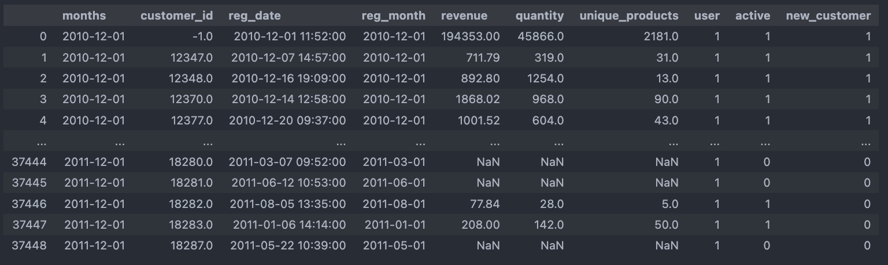

# Creating analytical tables with pandas and sql

Here is an example of creating analytical tables using Pandas and Sql tools based on monthly sales data.
The examples show how to get important information about user purchases from raw data.

## Notebooks provide examples of creating:

* Сalculate total income and count, income for all indicators per month, taking into account inactive months
* Create templates for analytical table with add an **auxiliary key**
* Find user registration date
* Сalculate revenue per user (taking into account inactive months)
* Сalculate registered users
* Mark active users who buy anything in month
* How many new users come per month
* Average number of items purchased by active customers and mean unique products mean

  
  

## How to install
To work with **SQL_Creating_analytical_tables.ipynb** you must have a local Postgres installation deployed or access via a url like

### Packages used:
* pandas
* numpy
* datetime
* matplotlib
* plotly
* sqlalchemy